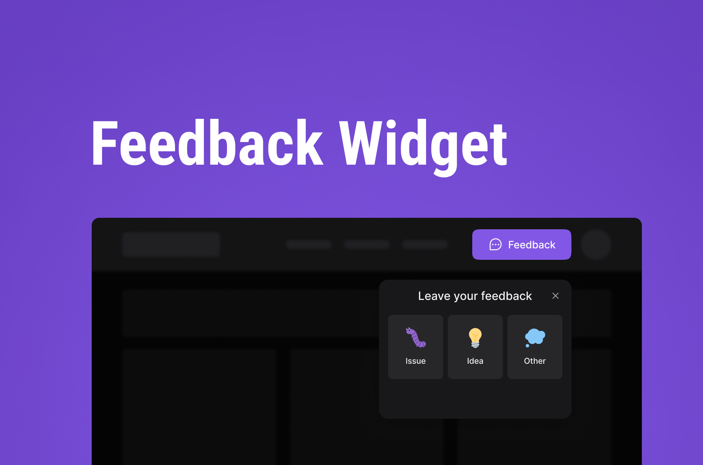

# Feedback-Widget

The project is called Feedback Widget. It is a tool where the user can leave feedback in case of a issue, an idea or other, this tool allows the user to describe his issue/idea/other along with the screenshot functionality. 

🔗 Live demo:  [feedback-widget](https://feedback-widget-xi-snowy.vercel.app)


<p align="center">
</p>


## 🚀 Technologies

- ⚛️ React.js
- 🟦 TypeScript
- 🎨 Tailwind CSS
- 🌐 Node.js
- 🚂 Express
- 🧬 Prisma
- 🛢️ PostgreSQL
- 🧪 Jest


## 🧰 Features
- Accessible and styled forms
- Screenshot capture functionality
- Feedback submission system
- Modern UI components
- HTTP requests
- Custom scrollbars
- Icon system
- Feedback API
- Sends feedback via email
- Database integration
- Unit tests


## 📦 Install the project 

```
# Clone the repository
$ git clone git@github.com:xeniaalex3/Feedback-Widget.git

# Access the project folder at the command prompt
$ cd Feedback-Widget

# Access the web version of the project 
$ cd web

# Install the dependencies
$ npm install

# Run the script 
$ npm run dev 

```
